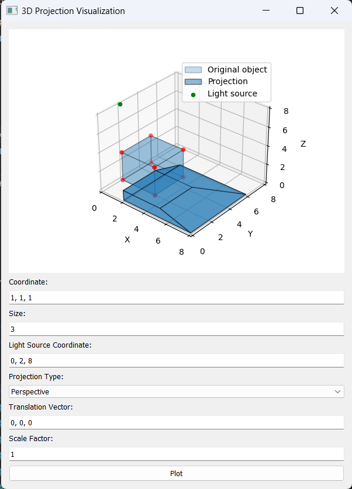

# 3D Projection Visualization Application

## Overview
- This application allows users to visualize 3D projections of objects in different perspectives, including orthographic, oblique, and perspective projections. It utilizes PyQt5 for the graphical user interface and Matplotlib for 3D plotting.

## Features
- **Object Manipulation:** Enter object coordinates, size, translation vector, and scale factor.
- **Light Source:** Specify the light source coordinates for dynamic projections.
- **Projection Types:** Choose between Parallel (Orthographic, Oblique), and Perspective projections.
- **Interactive Plotting:** Visualize the original object and its projection dynamically.

## Getting Started
**Prerequisites**
- Python 3.10 or higher (using match case)
- PyQt5
- NumPy
- Matplotlib

## Installation
1. Clone the repository:
```
git clone https://github.com/nguyenngocvy1/3D-Projection-Visualization-Application.git
```
2. Install dependencies:
```
pip install -r requirements.txt
```
## Usage
1. Run the application:
```
python main.py
```
or
```
python projection.py
```
2. Enter object details, light source coordinates, and projection type.
3. Click the "Plot" button to visualize the 3D projection.

## Examples
### Orthographic Projection

### Oblique Projection

### Perspective Projection


## Algorithms
- Get light direction vectors
- Normalize light direction vectors (length=1)
- Find scale ratios based on light direction vectors and distance from points to xy plane
- Scale light direction vectors to intersect the xy plane
- The intersections between light direction vectors and the xy plane is summarization of points coordinates and vectors (vector = second point coordinate - first point coordinate)


